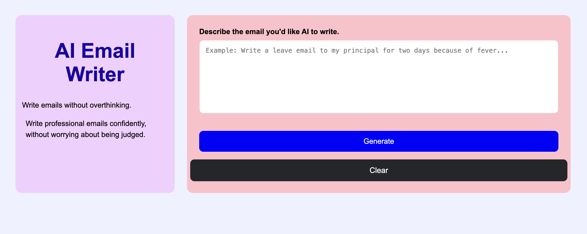

# AI Email Writer ✉️

An AI-powered email writing web application built using **Flask**, **HTML**, **CSS**, and **Google Gemini API**.

## Features

- Generate professional emails using AI
- Clear input with one click
- Smooth CSS animations
- Responsive sidebar layout
- User-friendly interface
- Error handling for empty input

## Technologies Used

- Python
- Flask
- HTML5
- CSS3
- Google Gemini API

## Project Structure

```
AI-Email-Writer/
│
├── app.py
├── templates/
│   └── index.html
└── static/
    └── style.css
```

## Future Improvements

- Copy Email button
- Dark Mode
- Responsive Mobile Layout
- Email History
- Download Email as PDF

## Author

Made by **Kriday Verma**
